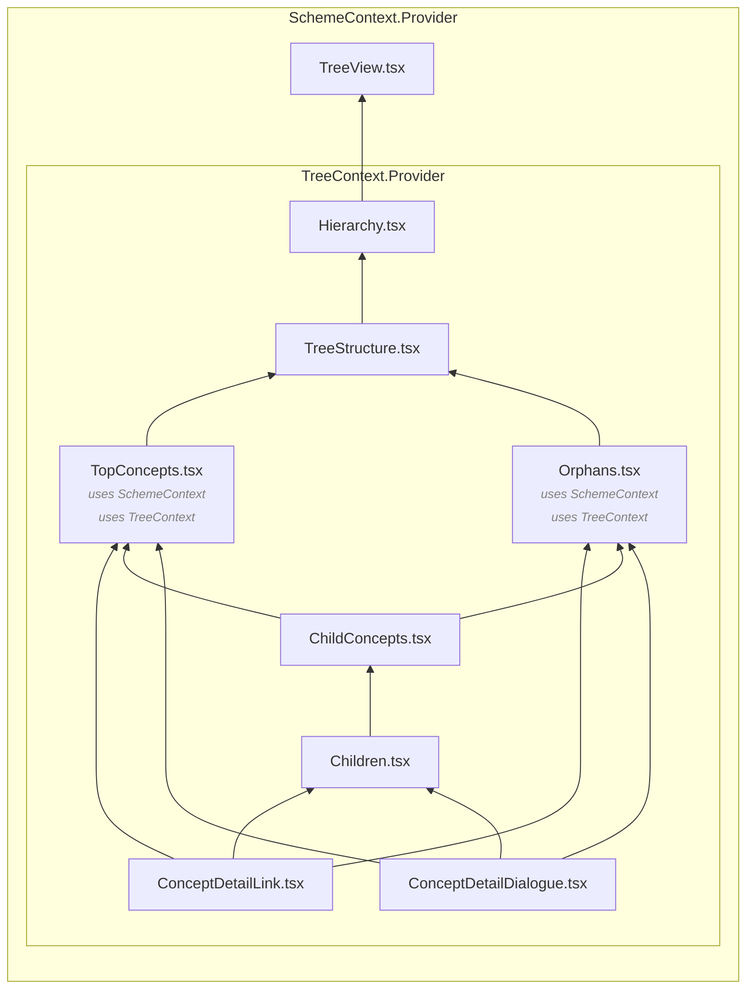
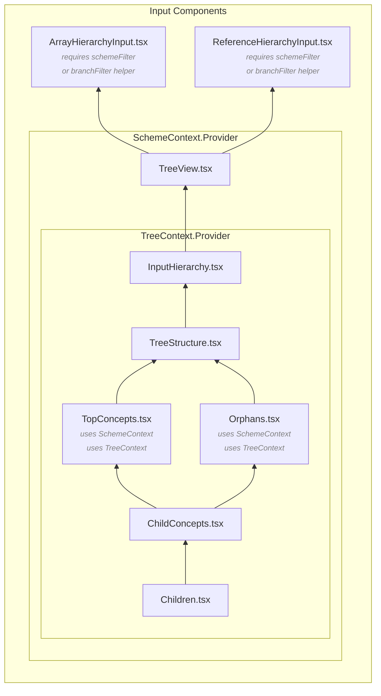

# Sanity Taxonomy Manager


### Create and manage SKOS compliant taxonomies, thesauri, and classification schemes in Sanity Studio.

<!-- Taxonomies are crucial tools for organization and interoperability between and across data sets. Taxonomy Manager provides a way for content authors to create, use, and maintain standards compliant taxonomies in Sanity Studio.

The Taxonomy Manager document schema is based on the [World Wide Web Consortium](https://www.w3.org/) (W3C) [Simple Knowledge Organization Scheme](https://www.w3.org/TR/skos-reference/) (SKOS) recommendation. Concept and concept scheme editor tools include standard SKOS properties, hints for creating consistent concepts and vocabularies, and validation functions for preventing consistency errors. -->

|  |
| ----------------------------------------------------------------------- |

## Documentation

For full documentation, visit [sanitytaxonomymanager.com](https://sanitytaxonomymanager.com).

## Features

<!-- make this more concise -->

- Adds two document types to your Sanity schema which are used to generate [SKOS](https://www.w3.org/TR/skos-primer/) compliant concepts and taxonomies: `skosConcept` and `skosConceptScheme`
- Includes reference filter helpers to allow you to easily include a specific taxonomy, or particular branch of a taxonomy in your Sanity documents
- Encourages taxonomy and thesaurus design best practices by enforcing [disjunction between Broader and Related relationships](https://www.w3.org/TR/skos-reference/#L2422) and [disjunction between Preferred and Alternate/Hidden labels](https://www.w3.org/TR/skos-reference/#L1567)
- Standards compliant architecture means that taxonomy terms and structures can be migrated to standards compliant standalone tools when you need higher level taxonomy and knowledge graph support.

## Installation

In your Sanity project folder, run

```bash
npm i sanity-plugin-taxonomy-manager
```

or

```bash
yarn add sanity-plugin-taxonomy-manager
```

## Configuration

Add the plugin to your [project configuration](https://www.sanity.io/docs/configuration#51515480034b) to add the Taxonomy Manager Tool to your studio workspace.

```js
// sanity.config.js

import {defineConfig} from 'sanity'
import {structureTool} from 'sanity/structure'
import {taxonomyManager} from 'sanity-plugin-taxonomy-manager'
import {schemaTypes} from './schemas'

export default defineConfig({
  name: 'default',
  title: 'Sanity Studio',
  projectId: '<projectId>',
  dataset: 'production',
  plugins: [
    structureTool(),
    // Include the taxonomy manager plugin
    taxonomyManager({
      // Optional: Set a Base URI to use for new concepts & concept schemes
      baseUri: 'https://example.com/',
      // Optional: Use `customConceptFields` and `customSchemeFields` keys to add custom fields to Concept or Concept Scheme document types
      customConceptFields: [
        {
          name: 'sameAs',
          title: 'Same As',
          type: 'url',
          description:
            'Specify a fully qualified IRI that identifies the same concept in another vocabulary',
        },
      ],
    }),
  ],
  schema: {
    types: schemaTypes,
  },
})
```

The plugin adds `skosConcept` and `skosConceptScheme` document types to your studio. Use a filter on `documentTypeListItems` in the [desk tool configuration](https://www.sanity.io/docs/desk-tool-api) to exclude taxonomy manager document types from your main document view.

```js
// sanity.config.js

import {defineConfig} from 'sanity'
import {structureTool} from 'sanity/structure'
import {taxonomyManager} from 'sanity-plugin-taxonomy-manager'
import {schemaTypes} from './schemas'

export default defineConfig({
  name: 'default',
  title: 'Sanity Studio',
  projectId: '<projectId>',
  dataset: 'production',
  plugins: [
    structureTool({
      structure: (S) =>
        S.list()
          .title('Content')
          .items([
            ...S.documentTypeListItems().filter(
              (listItem) => !['skosConcept', 'skosConceptScheme'].includes(listItem.getId())
            ),
          ]),
    }),
    taxonomyManager(),
  ],
  schema: {
    types: schemaTypes,
  },
})
```

## Contributing

Community collaboration is highly encouraged. To make sure your contributions are aligned with project goals and principles, please read the [contributing docs](https://sanitytaxonomymanager.com/#/contributing) before submitting a pull request.

- This plugin uses [@sanity/plugin-kit](https://github.com/sanity-io/plugin-kit)
  with default configuration for build & watch scripts.

- See [Testing a plugin in Sanity Studio](https://github.com/sanity-io/plugin-kit#testing-a-plugin-in-sanity-studio)
  on how to run the plugin with hot-reload in the studio.

### Component Diagrams

The following diagrams map out the relationships between the components used in this plugin and are intended to help those interested in contributing to the project orient themselves. The Taxonomy Manager tree view is designed to support polyhierarchy, and to provide UI affordances common to other taxonomy management tools, both of which lend some complexity to the component structure.

> [!TIP]
> You **do not** need to understand any of this to use the plugin!

<Details>
<Summary><h4>Tree View</h4></Summary>

The [Tree View component](docs/_images/taxonomyManager.png) creates the user interface for interacting with a given taxonomy (SKOS Concept Scheme) visually in the Sanity Structure tool.



</Details>

<Details>
<Summary><h4>Input Components</h4></Summary>

The [ReferenceHierarchyInput and ArrayHierarchyInput components](https://sanitytaxonomymanager.com/#/?id=tree-view-input-component) afford a field-level hierarchical browse and selection experience for taxonomy terms. Both components draw on filter options supplied by the `schemeFilter` and `branchFilter` helper functions.



</Details>

## License

MIT © Andy Fitzgerald
See LICENSE
