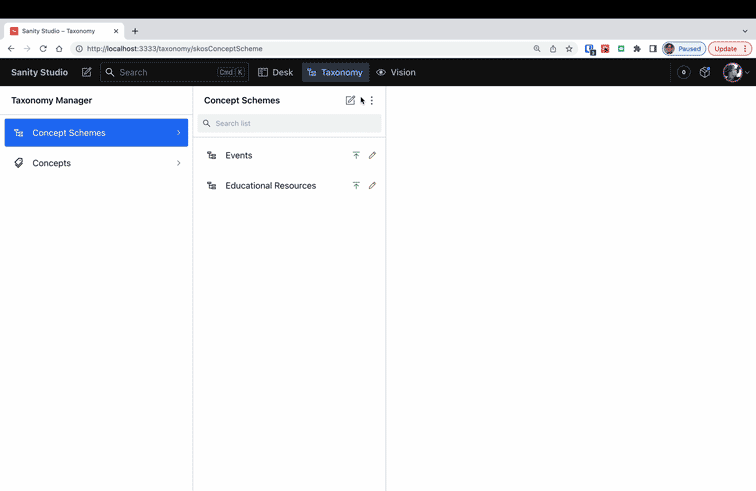
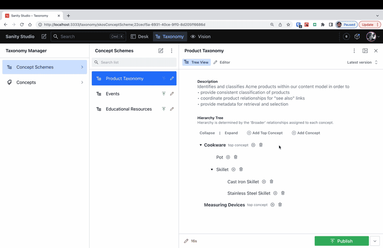
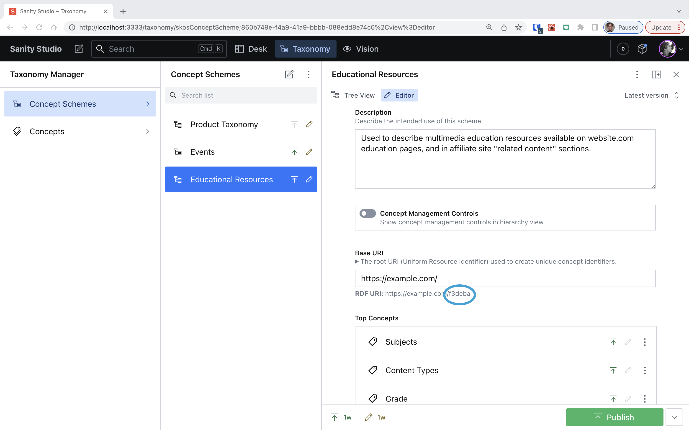
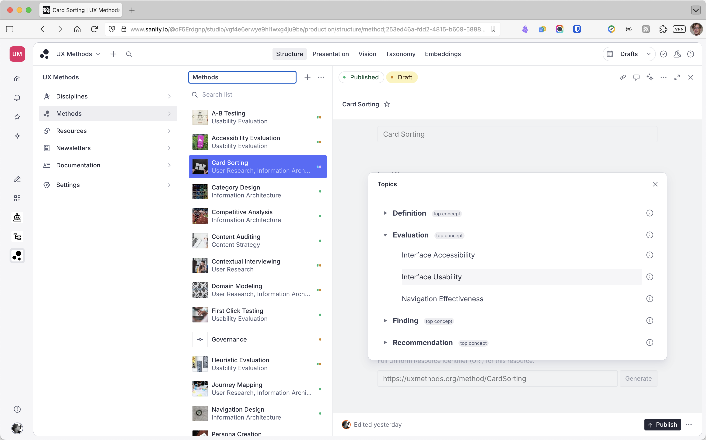
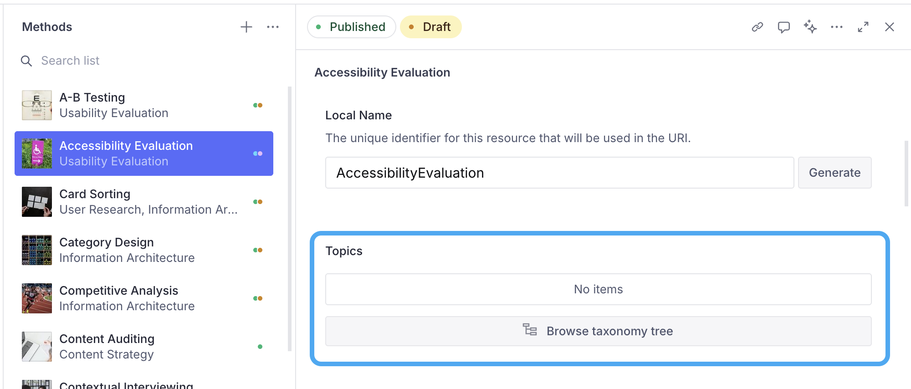
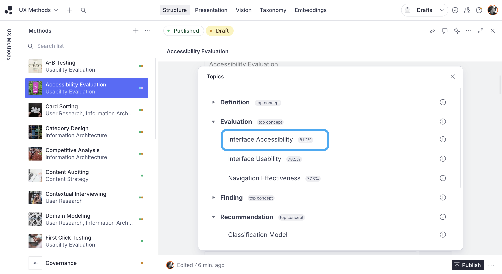

<h1 class="title">Documentation</h1>

[filename](_includes/shields.md ':include')

<p class='large'>Sanity Taxonomy Manager adds a set of tools and two document types to your Sanity Studio &mdash; SKOS Concept and SKOS Concept Scheme &mdash; that you can use to create, organize, and use standards compliant taxonomies.<p>

## Getting Started

### Installation

In your Sanity project folder, run:

```bash
npm install sanity-plugin-taxonomy-manager
# or
pnpm add sanity-plugin-taxonomy-manager
# or
yarn add sanity-plugin-taxonomy-manager
```

### Configuration

Add `taxonomyManager()` to the plugins array of your [project configuration](https://www.sanity.io/docs/configuration#51515480034b). This will make the Taxonomy Manager Tool available in your studio workspace.

```js
// sanity.config.js

import {defineConfig} from 'sanity'
import {structureTool} from 'sanity/structure'
import {taxonomyManager} from 'sanity-plugin-taxonomy-manager'
import {schemaTypes} from './schemas'

export default defineConfig({
  name: 'default',
  title: 'Sanity Studio',
  projectId: '<projectId>',
  dataset: 'production',
  plugins: [
    structureTool(),
    // Include the taxonomy manager plugin
    taxonomyManager({
      // Optional: Set a Base URI to use for new concepts & concept schemes
      baseUri: 'https://example.com/',
    }),
  ],
  schema: {
    types: schemaTypes,
  },
})
```

The plugin adds `skosConcept` and `skosConceptScheme` document types to your studio. If you display all documents by default, you can use a filter on `documentTypeListItems` in the [desk tool configuration](https://www.sanity.io/docs/desk-tool-api) to exclude taxonomy manager document types from your main document view.

```js
// sanity.config.js

import {defineConfig} from 'sanity'
import {structureTool} from 'sanity/structure'
import {taxonomyManager} from 'sanity-plugin-taxonomy-manager'
import {schemaTypes} from './schemas'

export default defineConfig({
  name: 'default',
  title: 'Sanity Studio',
  projectId: '<projectId>',
  dataset: 'production',
  plugins: [
    structureTool({
      structure: (S) =>
        S.list()
          .title('Content')
          .items([
            ...S.documentTypeListItems().filter(
              (listItem) => !['skosConcept', 'skosConceptScheme'].includes(listItem.getId())
            ),
          ]),
    }),
    taxonomyManager({
      baseUri: 'https://example.com/',
    }),
  ],
  schema: {
    types: schemaTypes,
  },
})
```

### Options

#### BaseURI

The `baseURI` option allows you to set a default URI (Uniform Resource Identifier) for new concepts and concept schemes. Unique identifiers allow for the clear and unambiguous identification of concepts across namespaces, for example between `https://shipparts.com/vocab/Bow` and `https://wrappingsupplies.com/vocab/Bow`. The base URI of these concepts is `https://shipparts.com/vocab/` and `https://wrappingsupplies.com/vocab/`, respectively.

- In most cases, it makes sense for your base URI to be a directory or subdirectory of your website.
- In all cases, the URI you choose should be in a domain that you control.
- The `baseUri` default is optional. If you omit it, the Base URI for new concepts and concept schemes is pre-populated based on the most recently used Base URI value.

#### Identifier

Concepts and concept schemes are assigned an unique identifier upon creation using [Nano ID](https://github.com/ai/nanoid). The generated ID which is appended to the BaseURI to create the concept or scheme's unique URI. By default these identifiers are randomly generated six character alphanumeric characters, including letters, numbers, -, and \_.

Identifier generation can be modified by passing in configuration options for:

- `pattern` (the character set to use for identifiers)
- `length` (default: 6)
- `prefix`, which is used to prepend to generated identifiers, for example to use Wikidata style IDs like "Q27521" (default: "").

You can also set the `regenUi` key to `true` to display a "Create Unique Identifier" button in the UI. This allows you to regenerate keys from the UI that may need to change after you've altered any of the options above. Use this for small vocabularies where changing individual identifiers is faster than writing and running a script.

#### Custom Fields

The `customConceptFields` and `customSchemeFields` keys allow you to specify additional fields for `skosConcept` and `skosConceptScheme` document types. Add new fields as an array, either with or without Sanity's `defineField()` function.

```js
// sanity.config.js
taxonomyManager({
  baseUri: 'https://example.com/',
  customConceptFields: [
    {
      name: 'sameAs',
      title: 'Same As',
      type: 'url',
      description:
        'Specify a fully qualified IRI that identifies the same concept in another vocabulary',
    },
  ],
  customSchemeFields: [
    {
      name: 'approvedBy',
      title: 'Approved By',
      type: 'object',
      fields: [
        {
          name: 'name',
          title: 'Name',
          type: 'string',
        },
        {
          name: 'date',
          title: 'Date',
          type: 'date',
        },
      ],
    },
  ],
})
```

Custom fields will appear on all Concept and Concept Scheme documents accordingly.

### Importing Terms

Sanity offers a CLI and several client libraries for [importing content data](https://www.sanity.io/docs/content-lake/importing-data) into the Studio. There is also an [Import Taxonomy Terms](https://www.sanity.io/recipes/import-taxonomy-terms-b46af03f) script available on Sanity Exchange for importing SKOS formatted taxonomies directly into Taxonomy Manager. The import tool assumes your taxonomy is formatted using the provided [Google Sheets template](https://docs.google.com/spreadsheets/d/1eWaO_8pOdC7QwN4umnRnniEVFECMUc1b42FA3Ea7D0c/edit?gid=1890562484#gid=1890562484). Please see the [script documentation on Sanity Exchange](https://www.sanity.io/recipes/import-taxonomy-terms-b46af03f) for details.

### Demos & Tutorials

#### Ranked Lists of Related Content in Sanity Studio

Here are three simple approaches I use to generate ranked lists of related content using taxonomy tags managed in Sanity Studio.

<iframe width="640" height="360" src="https://www.youtube.com/embed/-A8FfdfkFRw?si=dUYyY0gBApBTWk5S" title="YouTube video player" frameborder="0" allow="accelerometer; autoplay; clipboard-write; encrypted-media; gyroscope; picture-in-picture; web-share" referrerpolicy="strict-origin-when-cross-origin" allowfullscreen></iframe>

#### Sanity Showcase Demo

A presentation on managing standards-based taxonomies in Sanity Studio and purposefully integrating tagging to support discovery, findability, and search for content collections. Delivered Apr 4, 2025 as part of Sanity's "Showcase" series.

<iframe width="640" height="360" src="https://www.youtube.com/embed/kkFRFtFSNeQ?si=H95eGKl69qr_jOCF" title="YouTube video player" frameborder="0" allow="accelerometer; autoplay; clipboard-write; encrypted-media; gyroscope; picture-in-picture; web-share" referrerpolicy="strict-origin-when-cross-origin" allowfullscreen></iframe>

### Taxonomy Design Resources

As you might imagine, there is much more to creating, using, and managing taxonomies than just configuring a tool. Here are a few resources I've found particularly insightful to help you expand on what is presented here:

#### Articles

- Grace Lau's [six part taxonomy series](https://boxesandarrows.com/building-the-business-case-for-taxonomy/), Boxes and Arrows
- "[Taxonomy 101: Definition, Best Practices, and How It Complements Other IA Work](https://www.nngroup.com/articles/taxonomy-101/)" by Page Laubheimer, Nielsen Norman Group
- Heather Hedden's [taxonomy articles](https://www.hedden-information.com/category/taxonomy-creation/) on the Accidental Taxonomist Blog
- [An Introduction to Taxonomies](https://uxbooth.com/articles/introduction-to-taxonomies/) by Sarah Khan, UX Booth

#### Standards & Recommendations

- [ANSI/NISO Z39.19-2005 (R2010): Guidelines for the Construction, Format, and Management of Monolingual Controlled Vocabularies](https://groups.niso.org/higherlogic/ws/public/download/12591/z39-19-2005r2010.pdf)
- [Semantic Interoperability Centre Europe: Guidelines and Good Practices for Taxonomies](https://joinup.ec.europa.eu/sites/default/files/document/2011-12/guidelines-and-good-practices-for-taxonomies-v1.3a.pdf)

#### Books

- [The Accidental Taxonomist](https://www.amazon.com/Accidental-Taxonomist-Third-Heather-Hedden/dp/1573875864), Heather Hedden, Information Today  
  An approachable, practical, and thorough introduction to taxonomy design, use, and management by a highly knowledgeable expert in the field. Now in its third edition (2022).

- [The Discipline of Organizing](https://mitpress.mit.edu/9780262518505/the-discipline-of-organizing/), ed. Robert Glushko, MIT Press  
  A broad and wide ranging reference for the principles and activities common across information organizing systems.

- [Building Ontologies with Basic Formal Ontology](https://mitpress.mit.edu/9780262527811/building-ontologies-with-basic-formal-ontology/), Robert Arp, Barry Smith & Andrew D. Spear, MIT Press  
  Though this text focuses on using the top level "Basic Formal Ontology" (BFO) to create application-specific domain ontologies, along the way the authors give excellent rationale, examples, and illustrations of term selection, definition, and relationships that apply to both ontology and taxonomy creation.

- [The Intellectual Foundation of Information Organization](https://mitpress.mit.edu/9780262512619/the-intellectual-foundation-of-information-organization/), Elaine Svenonius, MIT Press  
  If your inner four year old can't stop asking _why_ the best practices recommended in the rest of the literature are the way they are, Svenonious presents here a systematic tour of the cataloging, indexing, and classification foundations that digital information organization and retrieval.

## Building Taxonomies

### Creating Concept Schemes

[SKOS Concept Schemes](https://www.w3.org/TR/skos-reference/#schemes) allow you to group individual concepts (sometimes referred to as terms) together as individual taxonomies, thesauri, or classification schemes. While concepts can be created and used as standalone entities, concept schemes offer a convenient way to namespace and describe terms and relationships designed for specific purposes.



When you add a new concept scheme, Taxonomy Manager will prompt to you add a name and description, and will then prompt you to start adding concepts. If you have not set a default `baseUri`, the scheme will be created with the most recently used base URI. If you have not yet created any other concepts or schemes, you will need to enter a base URI in the editor tab before you can publish the scheme.

### Adding Concepts

You can create SKOS Concepts via Sanity Studio's New Document buttons, or from within a SKOS Concept Scheme. Creating concepts within a scheme automatically adds concepts to the scheme in question, and creates hierarchical relationships between terms based on where in the tree view they are added.

- **Top Concepts** are, by convention, used to signify the topmost concepts in the hierarchical relations for that scheme.  
  

- **Concepts** are the fundamental elements of a SKOS vocabulary. Concepts are the ideas, meanings, or (categories of) objects and events which underlie your knowledge organization systems. Concepts are distinct from the labels used to refer to them. This distinction is important because it is what allows you to change and iterate the details of labels based on performance or user expectations, and to localize concepts with labels in different languages without changing the meaning or semantics of your scheme.  
  

All fields _except_ Preferred Label and Base IRI are optional, and are to be used as best fits the needs of your information modeling task. All Concept fields map to elements of the machine readable data model described in the [W3C SKOS Recommendation](https://www.w3.org/TR/skos-reference/).

## Adding Schemes to Documents

Taxonomy Manager includes two Reference Filter helpers to help you include whole taxonomies or individual taxonomy branches in your document schemas. The filters use the automatically generated concept/scheme ID that is appended to your base URI to create the concept/scheme RDF identifier:



### Scheme Filter

To allow a `reference` field to access any term in a SKOS Concept Scheme, use the `schemeFilter` helper. The `schemeFilter` helper takes one parameter: the RDF URI ID from the Concept Scheme you want to use, located just below the `Base URI` field. Copy the identifier that follows your Base URI and use it as the value for `schemeId` in the `schemeFilter` settings object:

```js
import {schemeFilter} from 'sanity-plugin-taxonomy-manager'

...

defineField({
    name: 'gradeLevel',
    title: 'Grade Level',
    type: 'reference',
    to: {type: 'skosConcept'},
    options: {
      filter: schemeFilter({schemeId: 'f3deba'}),
      disableNew: true,
    },
  }),
```

### Branch Filter

To limit a `reference` field to a particular branch in a SKOS Concept Scheme, use the `branchFilter` helper. The `branchFilter` helper takes two parameters: the RDF URI ID from the Concept Scheme you want to use and the Concept ID in that Scheme to whose children your field is limited. The Concept ID can be a Top Concept, or any other concept (with children) in your scheme:

```js
import {branchFilter} from 'sanity-plugin-taxonomy-manager'

...

defineField({
    name: 'subject',
    title: 'Subject',
    type: 'reference',
    to: {type: 'skosConcept'},
    options: {
      filter: branchFilter({schemeId: 'f3deba', branchId: '25f826'}),
      disableNew: true,
    },
  }),
```

### Tree View Input Component

The tree view input component allows your authors to view your taxonomy hierarchy and access definitions, examples, and scope notes in context. Use with either the `schemeFilter` or `branchFilter`.



Add the component to a `reference` filed by importing `ReferenceHierarchyInput` from the plugin, and including it as a `field` component:

```js
import {ReferenceHierarchyInput} from 'sanity-plugin-taxonomy-manager'

...

defineField({
    name: 'topics',
    title: 'Topics',
    type: 'reference',
    to: {type: 'skosConcept'},
      options: {
        filter: branchFilter({schemeId: 'cf76c1', branchId: '1e5e6c'}),
        disableNew: true,
      },
      components: {field: ReferenceHierarchyInput},
  }),
```

To include the input component for an `array` input, import `ArrayHierarchyInput` and include it as a `field` component for your array.

```js
import {ArrayHierarchyInput} from 'sanity-plugin-taxonomy-manager'

...

    defineField({
      name: 'Habitats',
      title: 'Habitats',
      description: 'Array input component with scheme filter (scheme ids)',
      validation: rule => rule.max(3),
      type: 'array',
      of:[
        {
          type: 'reference',
          to: {type: 'skosConcept'},
          options: {
            filter: branchFilter({schemeId: 'cf76c1', branchId: '1e5e6c'}),
            disableNew: true,
          },
        },
      ],
      components: {field: ArrayHierarchyInput},
    }),
```

The component currently supports arrays from a single reference taxonomy, for which you can use either the scheme or branch filter helpers.

#### Loading the Hierarchy Tree as Open by Default

If your taxonomy includes hierarchical relationships, the tree will load "closed" be default. To load an open tree, add the `expanded: true` option to the `branchFilter()` or `schemeFilter()` parameters:

```js
import {ReferenceHierarchyInput} from 'sanity-plugin-taxonomy-manager'

...

defineField({
    name: 'topics',
    title: 'Topics',
    type: 'reference',
    to: {type: 'skosConcept'},
      options: {
        filter: branchFilter({schemeId: 'cf76c1', branchId: '1e5e6c', expanded: true}),
        disableNew: true,
      },
      components: {field: ReferenceHierarchyInput},
  }),
```

Loading an expanded tree can provide a better experience for Studio users when a hierarchical taxonomy is small or only has a single level.

#### Providing Only the Hierarchy Tree Input

By default, custom inputs such as the hierarchy tree input are displayed together with Sanity's standard Search input. While this provides the greatest flexibility for Studio users, it can also lead to "shortcuts" where Studio users tend to pick the first matching keyword instead of using the hierarchy to discover the most appropriate term.

You can suppress Sanity's default search field and require the use of the hierarchy tree input on a per-field basis by adding the `browseOnly` option to the `branchFilter()` or `schemeFilter()` configuration:

```js
import {ReferenceHierarchyInput} from 'sanity-plugin-taxonomy-manager'

...

defineField({
    name: 'topics',
    title: 'Topics',
    type: 'reference',
    to: {type: 'skosConcept'},
      options: {
        filter: branchFilter({schemeId: 'cf76c1', branchId: '1e5e6c', browseOnly: true}),
        disableNew: true,
      },
      components: {field: ReferenceHierarchyInput},
  }),
```

This creates an input that offers only the hierarchy input option for setting the associated field.



<!-- Omit Semantic Search instructions until I've worked through a more effective way to generate accurate results -->
<!-- #### Adding Term Recommendations with Semantic Search

If your dataset has [embeddings](https://www.sanity.io/docs/content-lake/dataset-embeddings) enabled, the input components can annotate hierarchy tree nodes with match scores based on the content your authors are editing. When enabled, opening the hierarchy tree input scores your `skosConcept` documents by semantic similarity — using the GROQ [`text::semanticSimilarity()`](https://www.sanity.io/docs/content-lake/search-content-with-groq) function — against the values of designated form fields, and displays a match percentage on each taxonomy term it identifies as relevant. This helps authors identify the most appropriate terms for their content without needing to manually review every node in the tree.



To use this feature, enable embeddings on your dataset. For the most relevant matches, scope the embeddings [projection](https://www.sanity.io/docs/content-lake/dataset-embeddings) to the fields your terms are matched against — typically each concept's preferred label and definition, plus scope notes and examples if you use them:

```sh
sanity datasets embeddings enable <dataset> \
  --projection='{ _type == "skosConcept" => { prefLabel, definition, scopeNote, example } }'
```

This projection embeds only your concepts; if other document types in your dataset also need semantic search, include them in the projection too. Embeddings generation runs asynchronously — check progress with `sanity datasets embeddings status <dataset>`. Until it is ready (or if embeddings are not enabled), the tree still renders normally and simply shows a notice in place of scores.

To add recommendations to a `reference` field, wrap `ReferenceHierarchyInput` in an inline component function and pass the `semanticSearch` prop:

```js
import {ReferenceHierarchyInput, schemeFilter} from 'sanity-plugin-taxonomy-manager'

...

defineField({
    name: 'topics',
    title: 'Topics',
    type: 'reference',
    to: [{type: 'skosConcept'}],
    options: {
      filter: schemeFilter({schemeId: 'f3deba'}),
      disableNew: true,
    },
    components: {
      field: (props) => (
        <ReferenceHierarchyInput
          {...props}
          semanticSearch={{
            fieldReferences: ['title', 'description'],
            maxResults: 4,
          }}
        />
      ),
    },
  }),
```

The same pattern works for `array` fields using `ArrayHierarchyInput`:

```js
import {ArrayHierarchyInput, branchFilter} from 'sanity-plugin-taxonomy-manager'

...

defineField({
    name: 'categories',
    title: 'Categories',
    type: 'array',
    of: [
      {
        type: 'reference',
        to: [{type: 'skosConcept'}],
        options: {
          filter: branchFilter({schemeId: 'f3deba', branchId: '25f826'}),
          disableNew: true,
        },
      },
    ],
    components: {
      field: (props) => (
        <ArrayHierarchyInput
          {...props}
          semanticSearch={{
            fieldReferences: ['title', 'description'],
            maxResults: 4,
          }}
        />
      ),
    },
  }),
```

The `semanticSearch` configuration object accepts the following options:

- **`fieldReferences`** (required): An array of field names from the current document whose values are concatenated and sent as the semantic search query. For example, `['title', 'metaDescription']` reads the current values of the `title` and `metaDescription` fields and uses them to find semantically similar taxonomy terms.
- **`maxResults`** (optional): The maximum number of matching terms to return. Defaults to `3`.

All fields listed in `fieldReferences` must contain a value when the hierarchy tree is opened. If any referenced fields are empty, a message is displayed in the tree view indicating which fields need to be filled in. -->
