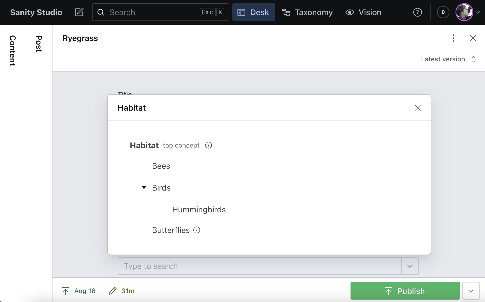

<h1 class="title">Documentation</h1>

[filename](_includes/shields.md ':include')

<p class='large'>Sanity Taxonomy Manager adds a set of tools and two document types to your Sanity Studio &mdash; SKOS Concept and SKOS Concept Scheme &mdash; that you can use to create, organize, and use standards compliant taxonomies.<p>

## Getting Started

### Installation

In your Sanity project folder, run

```bash
npm i sanity-plugin-taxonomy-manager
```

or

```bash
yarn add sanity-plugin-taxonomy-manager
```

### Configuration

Add `taxonomyManager()` to the plugins array of your [project configuration](https://www.sanity.io/docs/configuration#51515480034b). This will make the Taxonomy Manager Tool available in your studio workspace.

```js
// sanity.config.js

import {defineConfig} from 'sanity'
import {structureTool} from 'sanity/structure'
import {taxonomyManager} from 'sanity-plugin-taxonomy-manager'
import {schemaTypes} from './schemas'

export default defineConfig({
  name: 'default',
  title: 'Sanity Studio',
  projectId: '<projectId>',
  dataset: 'production',
  plugins: [
    structureTool(),
    // Include the taxonomy manager plugin
    taxonomyManager({
      // Optional: Set a Base URI to use for new concepts & concept schemes
      baseUri: 'https://example.com/',
    }),
  ],
  schema: {
    types: schemaTypes,
  },
})
```

The plugin adds `skosConcept` and `skosConceptScheme` document types to your studio. If you display all documents by default, you can use a filter on `documentTypeListItems` in the [desk tool configuration](https://www.sanity.io/docs/desk-tool-api) to exclude taxonomy manager document types from your main document view.

```js
// sanity.config.js

import {defineConfig} from 'sanity'
import {structureTool} from 'sanity/structure'
import {taxonomyManager} from 'sanity-plugin-taxonomy-manager'
import {schemaTypes} from './schemas'

export default defineConfig({
  name: 'default',
  title: 'Sanity Studio',
  projectId: '<projectId>',
  dataset: 'production',
  plugins: [
    structureTool({
      structure: (S) =>
        S.list()
          .title('Content')
          .items([
            ...S.documentTypeListItems().filter(
              (listItem) => !['skosConcept', 'skosConceptScheme'].includes(listItem.getId())
            ),
          ]),
    }),
    taxonomyManager({
      baseUri: 'https://example.com/',
    }),
  ],
  schema: {
    types: schemaTypes,
  },
})
```

### Options

#### BaseURI

The `baseURI` option allows you to set a default URI (Uniform Resource Identifier) for new concepts and concept schemes. Unique identifiers allow for the clear and unambiguous identification of concepts across namespaces, for example between `https://shipparts.com/vocab/Bow` and `https://wrappingsupplies.com/vocab/Bow`. The base URI of these concepts is `https://shipparts.com/vocab/` and `https://wrappingsupplies.com/vocab/`, respectively.

- In most cases, it makes sense for your base URI to be a directory or subdirectory of your website.
- In all cases, the URI you choose should be in a domain that you control.
- The `baseUri` default is optional. If you omit it, the Base URI for new concepts and concept schemes is pre-populated based on the most recently used Base URI value.

#### Identifier

Concepts and concept schemes are assigned an unique identifier upon creation using [Nano ID](https://github.com/ai/nanoid). The generated ID which is appended to the BaseURI to create the concept or scheme's unique URI. By default these identifiers are randomly generated six character alphanumeric characters, including letters, numbers, -, and \_.

Identifier generation can be modified by passing in configuration options for:

- `pattern` (the character set to use for identifiers)
- `length` (default: 6)
- `prefix`, which is used to prepend to generated identifiers, for example to use Wikidata style IDs like "Q27521" (default: "").

You can also set the `regenUi` key to `true` to display a "Create Unique Identifier" button in the UI. This allows you to regenerate keys from the UI that may need to change after you've altered any of the options above. Use this for small vocabularies where changing individual identifiers is faster than writing and running a script.

#### Custom Fields

The `customConceptFields` and `customSchemeFields` keys allow you to specify additional fields for `skosConcept` and `skosConceptScheme` document types. Add new fields as an array, either with or without Sanity's `defineField()` function.

```js
// sanity.config.js
taxonomyManager({
  baseUri: 'https://example.com/',
  customConceptFields: [
    {
      name: 'sameAs',
      title: 'Same As',
      type: 'url',
      description:
        'Specify a fully qualified IRI that identifies the same concept in another vocabulary',
    },
  ],
  customSchemeFields: [
    {
      name: 'approvedBy',
      title: 'Approved By',
      type: 'object',
      fields: [
        {
          name: 'name',
          title: 'Name',
          type: 'string',
        },
        {
          name: 'date',
          title: 'Date',
          type: 'date',
        },
      ],
    },
  ],
})
```

Custom fields will appear on all Concept and Concept Scheme documents accordingly.

### Importing Terms

Sanity offers a CLI and several client libraries for [importing content data](https://www.sanity.io/docs/content-lake/importing-data) into the Studio. There is also an [Import Taxonomy Terms](https://www.sanity.io/recipes/import-taxonomy-terms-b46af03f) script available on Sanity Exchange for importing SKOS formatted taxonomies directly into Taxonomy Manager. The import tool assumes your taxonomy is formatted using the provided [Google Sheets template](https://docs.google.com/spreadsheets/d/1eWaO_8pOdC7QwN4umnRnniEVFECMUc1b42FA3Ea7D0c/edit?gid=1890562484#gid=1890562484). Please see the [script documentation on Sanity Exchange](https://www.sanity.io/recipes/import-taxonomy-terms-b46af03f) for details.

### Demos & Tutorials

#### Ranked Lists of Related Content in Sanity Studio

Here are three simple approaches I use to generate ranked lists of related content using taxonomy tags managed in Sanity Studio.

<iframe width="640" height="360" src="https://www.youtube.com/embed/-A8FfdfkFRw?si=dUYyY0gBApBTWk5S" title="YouTube video player" frameborder="0" allow="accelerometer; autoplay; clipboard-write; encrypted-media; gyroscope; picture-in-picture; web-share" referrerpolicy="strict-origin-when-cross-origin" allowfullscreen></iframe>

#### Sanity Showcase Demo

A presentation on managing standards-based taxonomies in Sanity Studio and purposefully integrating tagging to support discovery, findability, and search for content collections. Delivered Apr 4, 2025 as part of Sanity's "Showcase" series.

<iframe width="640" height="360" src="https://www.youtube.com/embed/kkFRFtFSNeQ?si=H95eGKl69qr_jOCF" title="YouTube video player" frameborder="0" allow="accelerometer; autoplay; clipboard-write; encrypted-media; gyroscope; picture-in-picture; web-share" referrerpolicy="strict-origin-when-cross-origin" allowfullscreen></iframe>

## Taxonomy Design

Taxonomies come in a variety of shapes and sizes, ranging from huge hierarchies of thousands of terms, to small trees or lists of a handful of important concepts. While larger taxonomies can take teams of experts years to build, the "[open-world assumption](https://en.wikipedia.org/wiki/Open-world_assumption)" on which standards-based taxonomies are built means that small, purposeful taxonomies of well defined terms can also deliver value and form a solid foundation for future work.

Whether your taxonomy is large or small, attention to design best practices can help ensure that work performs and scales as intended. Here is a very high level summary of the common steps often involved in taxonomy creation:

1. [Formulate goals](#formulate-goals)
2. [Audit your content](#audit-your-content)
3. [Adopt, adapt, buy, or build](#adopt-adapt-buy-or-build)
4. [Identify & define concepts](#identify--define-concepts)
5. [Create relationships](#create-relationships)
6. [Review, test, and revise](#review-test-and-revise)
7. [Tag content](#tag-content)
8. [Establish Governance](#establish-governance)

### Steps

1.  #### Formulate Goals

    Identify what your taxonomy needs to accomplish. I recommend creating or adopting taxonomies _for_ a purpose, as opposed to _of_ a topic. Cross references, navigation, search support, personalization, or something else entirely: knowing what you need your taxonomy to accomplish will help you understand when you have enough coverage of your subject domain.

    > [!TIP] > [Domain modeling](https://www.andyfitzgeraldconsulting.com/writing/domain-modeling/) can help you understand how the concepts in your subject domain relate, and where a taxonomy may help intelligently connect them.

2.  #### Audit Your Content

    You have to understand the scope and scale of what you're organizing to know how best to arrange it. Auditing your content give you a qualitative picture of the quality and character of the resources in your collection. If you've never performed an audit, it can feel like a daunting task&mdash;especially if you have a lot of content&mdash;but the exercise provides invaluable perspective: without a clear understanding of what you have, everything else is guesswork.

3.  #### Adopt, Adapt, Buy, or Build

    Is there a free taxonomy that you can use or adapt to meet your goals? If so, start there. If not—especially if you don't realistically have the resources in-house—consider buying a published taxonomy if there's on that meets your needs. The research, iteration, and support paid resources provide may be well worth the cost. Build when you need to: for smaller taxonomies, those just beginning to use classification, or very specific domains, this may be the right option.

    > [!TIP]
    > The [Basic Register of Thesauri, Ontologies & Classifications](https://bartoc.org/about) (BARTOC) lets you search, compare, and access details about thousands of vocabularies in multiple languages, many of them available for free use. It's a great place to start a taxonomy search.

4.  #### Identify & Define Concepts

    Though we commonly think of taxonomies as hierarchies of terms, each of these "terms" is ultimately a label for a concept in your subject domain. Identifying the **concepts** you need to organize can help you focus on what you need to organize before getting mired in the organizational and usability details of what labels those things will have. Candidate concepts can be found in your content audit and other business resources, in your user research, and through discussions with stakeholders. Look for concepts that represent classes of things (as opposed to individual instances), and which have significance in your content, to your users, and to your organization.

    Once you've identified concepts, give them a preferred label and a brief definition based on the evidence you've collected. Clear definitions help ensure that when you test and vet terms and relationships with stakeholders and subject matter experts you're all talking about the same idea.

    > [!TIP]
    > Evidence for taxonomy term definitions and relationships is called "warrant" in the literature. See [ANSI/NISO Z39-19-2005 (2010)](https://groups.niso.org/higherlogic/ws/public/download/12591/z39-19-2005r2010.pdf) "5.3.5 Using Warrant to Select Terms" for a concise overview.

5.  #### Create Relationships

    Once you have enumerated and defined the concepts your taxonomy needs to organize, it's time to create relationships between then. Hierarchies based on parent-child "Broader Concept" relationships are perhaps the most common, and will likely be the primary kinds of connections you make in Type<!-- TODO: Link to Type example, once created --> and Topic <!-- TODO: Link to Topic example, once created -->taxonomies.

    

    Faceted<!-- TODO: Link to Type example, once created --> taxonomies also commonly use a shallow set of parent concepts (the facets) with allowed facet values as their children.

    Don't assume, however, that your taxonomy will necessarily be a tree. Create relationships based on the goals you established in step one. A set of well defined and controlled terms in a simple flat list can be incredibly useful in some contexts. "Related Concept" relationships are also a powerful way to create nuanced relationships between terms in order to achieve well defined outcomes.

    > [!NOTE]
    > Concepts cannot be related by both "Broader" and "Related" relationships. This is to help avoid the inference of unintended relationships between concepts at different levels of the hierarchy. See [SKOS Primer: 2.3.2 Associative Relationships](https://www.w3.org/TR/skos-primer/#secassociative) for details.

6.  #### Review, Test, and Revise

    Ideally, you should plan to review goals, audits, concepts, and relationships with stakeholders and subject matter experts as you go. At the very least, it is important to review your draft taxonomy with them to make sure you haven't missed anything from their point of view, and to ensure that your vision of the domain aligns with theirs.

    It is also important to test your draft taxonomy with future users: both those who will tag content, and those who will use the taxonomy to find content by browsing or search. Which tests to perform will depend on how your taxonomy will be used and what outcomes it is intended to achieve. Card sorting (usually closed sorting at this phase), tree testing, A/B testing, and prototype usability testing are all testing methods to consider. Be sure to do this early enough in your project that you leave time to revise based on what you learn and integrate changes.

7.  #### Tag Content

    Depending on the volume of content you need to tag, you may opt for automated or manual approaches. Natural language processing (NLP) tools&mdash;and yes, generative AI&mdash;can be used to automate the tagging process. Even the best of tools are not error free, so it is important for a human with background on the project and the taxonomy to review tags prior to unleashing them on your users.

    Manual tagging can be a good option if you have a small content collection, an army of interns, or are tagging new content as you go. Don't assume that your taggers or writers will intuitively know how to correctly tag content in a way that achieves the goals you've envisioned. Training should include background on what the purposes the taxonomy serves, an orientation to the structure of the taxonomy and concept definitions, and practice applying tags to different types of content.

8.  #### Establish Governance

    Taxonomies are never finished. Rather, they are living systems that grow and evolve with the business. The goal of governance is to create a repeatable, accountable, visible, and predictable process for managing taxonomy changes.

    Successful taxonomy governance establishes long-term ownership and responsibility for taxonomies, responds to feedback from taxonomy users, and assures the sustainable evolution of taxonomies in response to changes in user and system needs. Governance activities include periodic review of taxonomy performance and responding to suggestions, requests, and problems raised by taxonomy users.

<!-- Merge this once I have at least two here -->

### Common Structures

Taxonomies can take a wide range of shapes and sizes, depending on the purposes for which they're created and the subject matter they're designed to represent. There are, nonetheless, a few common patterns that tend to be a good fit for a lot of knowledge representation needs. If you're creating a taxonomy from scratch or adapting one to your needs, consider one of the patterns below as a starting point.

#### Type Taxonomy

Type taxonomies are a crucial tool for organizing digital content for findability and discovery. Product catalogs, services listings, resource types, and subject hierarchies are all commonly characterized by "type" organization: each child category describes a more specialize type of thing than the parent category. Well defined type taxonomies area powerful tool for making your content more discoverable and reusable across contexts.

![First example: Housing Advice, subtopics: Foreclosure Counseling, Homebuyer Education; Residential Housing, subtopics: Long-Term Housing, subtopics: Assisted Living, Independent Living, Nursing Home, Public Housing; Safe Housing, Short-Term Housing, subtopics: Nursing Home, Sober Living. Second example: How-To, subtopics: Clinical Procedure, subtopics: Assessment, Intervention; Electronic Health Record (EHR) How-To, Equipment Operation, subtopics: Equipment Setup, Equipment Troubleshooting, Equipment Use; Newsletter. Third example: Anthropology(258), subtopics: Archaeology(101), Sociology(81); Arts and Music(119), Biology(875), subtopics: Ecology(492), Genetics(45), Health(142), Chemistry(62). Fourth example: Specialty Bikes (65), Mountain Bikes (57), Electric Bikes (50), Road Bikes (44), subtopics: Gravel Bikes (32), Endurance Bikes (7), Electric Road Bikes (6), Touring Bikes (5); Kids' Bikes (40), Hybrid Bikes (27).](_images/type-taxonomies%E2%80%93blue.png)

_Examples of type taxonomies (clockwise from top-left): The Open Eligibility Project (human services), Elemeno Health (resource types, using the Sanity Taxonomy Manager plugin), National Geographic (education subjects), REI (product categories)_

Type classification helps users navigate and browse categories from general to more specific and narrow down large content sets to specific items that meet their needs. It also allows information designers to assemble related content into meaningful collections and to provide richer search results based on parent/child relationships.

When combined with search term and traffic data, type taxonomies help you to draw deeper insight from visitor behaviors, and they can play a vital role in providing AI the ground truth it needs to return reliable, trustworthy results.

**Key Features**

- **Relationships:** Type taxonomies organize concepts in "is-a" relationships: "Nutrition Education" is a type of "Health Education," which is a type of "Education." These relationships, when consistently maintained, help users to confidently navigate categories, and can allow algorithms to accurately draw inferences about resources tagged with taxonomy terms.
- **Adaptability:** Type taxonomies can be tailored to a wide range of specific content collections or subject domains.
- **Flexibility:** Type taxonomies can be used to add structure to simple domains with only a handful of concepts, or can scale to many thousands of terms.

#### Topic Taxonomy

Topic taxonomies give you a way to group ideas or things that have meaningful associations for your users or your business, but are not necessarily sub-types of one another or of a common parent concept. "Prescription cat food" is "cat food," which is in turn "pet food." Your users however, may look for "kidney diet" cat food under the "cat" category—and "cat food" is not a cat. This is where topic taxonomies can help.


_Detail views of the topical categories on the Columbia and Patagonia retail websites._

Topic classification is often used to provide multiple pathways to a concept, article, or product. Topic classification is also a powerful way to express brand differentiation. Columbia and Patagonia both make and sell a similar range of outdoor activity apparel for adults and kids, and products for both companies fall into clearly delineated types: jackets, shirts, base layers, pants, etc. Topical grouping on each site (which, when at the top level we usually call "categories") tell users of each site what kind of "place" it is.

**Key Features**

- **Relationships:** Topic taxonomies may only be a singe level, or comparatively shallow, and often combine parent-child "is-a" and whole-part "has-a" relationships freely.
- **Adaptability:** Topic taxonomies are much more flexible than "type" taxonomies, and can be used to express a brand's (or user's) particular perspective.
- **Size Limitations:** Topic taxonomies are often are not very large: because the relationships are less strict than in many Type taxonomies, large structures in Topic taxonomies may end up hiding concepts in categories users may not expect.

#### Faceted Taxonomy

Faceted taxonomies are a great option for organizing and classifying resources that don't fit neatly into a single hierarchical tree structure. Consider a faceted taxonomy if you find that you repeat categories at the lower levels of your hierarchical taxonomy, or if there are no clear candidates for top level categories, such as when resources need to be classified in different ways for different audiences.


_Side by side comparison of recipe categories presented as a hierarchy and as facets_

Faceted classification offers an alternative to the rigidity of tree structures for content that has similar attributes. The example shown above also illustrates an important consideration in the design of effective facets: the attributes described in each facet should be mutually exclusive (you'll hear taxonomists refer to this as "orthogonality"). The values in "Cuisine," for example, have no overlap with the values in "Course" or "Dish." Likewise, the label "Latin American" will only ever appear in the Cuisine menu.

**Key Features**

- **Relationships:** While orthogonality is a key feature of the relationship between facets, within each facet concepts may be structured in any way that makes sense to the taxonomy's target users. Simple lists are by far the most common, but individual facets can also be structured as hierarchies or trees with different kinds of relationships (part/whole, cause/effect, sequence, etc).
- **Adaptability:** While special care needs to be taken to identify and test facets based on user and business needs and the content being organized, the collection of terms within individual facets tend to accommodate new entities easily. This makes them attractive options for resource collections of mostly homogenous content that is expected to evolve and change over time.
- **Size Limitations:** Facets allow you to present multiple, mutually exclusive organization schemes easily. The tradeoff is that they introduce additional complexity into discovery and findability. If you find you have fewer than three facets, a type or topic taxonomy may work just as well for your content collection (and introduce less complexity for your users). At the upper end, unless you're building a system for expert users, limit your facets to a half dozen or so.

### Resources

As you might imagine, there is much more to creating, using, and managing taxonomies than is covered in this brief guide. Here are a few resources I've found particularly insightful to help you expand on what is presented here:

#### Articles

- Grace Lau's [six part taxonomy series](https://boxesandarrows.com/building-the-business-case-for-taxonomy/), Boxes and Arrows
- "[Taxonomy 101: Definition, Best Practices, and How It Complements Other IA Work](https://www.nngroup.com/articles/taxonomy-101/)" by Page Laubheimer, Nielsen Norman Group
- Heather Hedden's [taxonomy articles](https://www.hedden-information.com/category/taxonomy-creation/) on the Accidental Taxonomist Blog
- [An Introduction to Taxonomies](https://uxbooth.com/articles/introduction-to-taxonomies/) by Sarah Khan, UX Booth

#### Standards & Recommendations

- [ANSI/NISO Z39.19-2005 (R2010): Guidelines for the Construction, Format, and Management of Monolingual Controlled Vocabularies](https://groups.niso.org/higherlogic/ws/public/download/12591/z39-19-2005r2010.pdf)
- [Semantic Interoperability Centre Europe: Guidelines and Good Practices for Taxonomies](https://joinup.ec.europa.eu/sites/default/files/document/2011-12/guidelines-and-good-practices-for-taxonomies-v1.3a.pdf)

#### Books

- [The Accidental Taxonomist](https://www.amazon.com/Accidental-Taxonomist-Third-Heather-Hedden/dp/1573875864), Heather Hedden, Information Today  
  An approachable, practical, and thorough introduction to taxonomy design, use, and management by a highly knowledgeable expert in the field. Now in its third edition (2022).

- [The Discipline of Organizing](https://mitpress.mit.edu/9780262518505/the-discipline-of-organizing/), ed. Robert Glushko, MIT Press  
  A broad and wide ranging reference for the principles and activities common across information organizing systems.

- [Building Ontologies with Basic Formal Ontology](https://mitpress.mit.edu/9780262527811/building-ontologies-with-basic-formal-ontology/), Robert Arp, Barry Smith & Andrew D. Spear, MIT Press  
  Though this text focuses on using the top level "Basic Formal Ontology" (BFO) to create application-specific domain ontologies, along the way the authors give excellent rationale, examples, and illustrations of term selection, definition, and relationships that apply to both ontology and taxonomy creation.

- [The Intellectual Foundation of Information Organization](https://mitpress.mit.edu/9780262512619/the-intellectual-foundation-of-information-organization/), Elaine Svenonius, MIT Press  
  If your inner four year old can't stop asking _why_ the best practices recommended in the rest of the literature are the way they are, Svenonious presents here a systematic tour of the cataloging, indexing, and classification foundations that digital information organization and retrieval.

## Building Taxonomies

### Creating Concept Schemes

[SKOS Concept Schemes](https://www.w3.org/TR/skos-reference/#schemes) allow you to group individual concepts (sometimes referred to as terms) together as individual taxonomies, thesauri, or classification schemes. While concepts can be created and used as standalone entities, concept schemes offer a convenient way to namespace and describe terms and relationships designed for specific purposes.


When you add a new concept scheme, Taxonomy Manager will prompt to you add a name and description, and will then prompt you to start adding concepts. If you have not set a default `baseUri`, the scheme will be created with the most recently used base URI. If you have not yet created any other concepts or schemes, you will need to enter a base URI in the editor tab before you can publish the scheme.

### Adding Concepts

You can create SKOS Concepts via Sanity Studio's New Document buttons, or from within a SKOS Concept Scheme. Creating concepts within a scheme automatically adds concepts to the scheme in question, and creates hierarchical relationships between terms based on where in the tree view they are added.

- **Top Concepts** are, by convention, used to signify the topmost concepts in the hierarchical relations for that scheme. Top Concepts can be used to denote the broadest categories in a hierarchy, or to describe facets in a faceted taxonomy.  
  

- **Concepts** are the fundamental elements of a SKOS vocabulary. Concepts are the ideas, meanings, or (categories of) objects and events which underlie your knowledge organization systems. Concepts are distinct from the labels used to refer to them. This distinction is important because it is what allows you to change and iterate the details of labels based on performance or user expectations, and to localize concepts with labels in different languages without changing the meaning or semantics of your scheme.  
  

All fields _except_ Preferred Label and Base IRI are optional, and are to be used as best fits the needs of your information modeling task. All Concept fields map to elements of the machine readable data model described in the [W3C SKOS Recommendation](https://www.w3.org/TR/skos-reference/).

## Adding Schemes to Documents

Taxonomy Manager includes two Reference Filter helpers to help you include whole taxonomies or individual taxonomy branches in your document schemas. The filters use the automatically generated concept/scheme ID that is appended to your base URI to create the concept/scheme RDF identifier:


### Scheme Filter

To allow a `reference` field to access any term in a SKOS Concept Scheme, use the `schemeFilter` helper. The `schemeFilter` helper takes one parameter: the RDF URI ID from the Concept Scheme you want to use, located just below the `Base URI` field. Copy the identifier that follows your Base URI and use it as the value for `schemeId` in the `schemeFilter` settings object:

```js
import {schemeFilter} from 'sanity-plugin-taxonomy-manager'

...

defineField({
    name: 'gradeLevel',
    title: 'Grade Level',
    type: 'reference',
    to: {type: 'skosConcept'},
    options: {
      filter: schemeFilter({schemeId: 'f3deba'}),
      disableNew: true,
    },
  }),
```

### Branch Filter

To limit a `reference` field to a particular branch in a SKOS Concept Scheme, use the `branchFilter` helper. The `branchFilter` helper takes two parameters: the RDF URI ID from the Concept Scheme you want to use and the Concept ID in that Scheme to whose children your field is limited. The Concept ID can be a Top Concept, or any other concept (with children) in your scheme:

```js
import {branchFilter} from 'sanity-plugin-taxonomy-manager'

...

defineField({
    name: 'subject',
    title: 'Subject',
    type: 'reference',
    to: {type: 'skosConcept'},
    options: {
      filter: branchFilter({schemeId: 'f3deba', branchId: '25f826'}),
      disableNew: true,
    },
  }),
```

### Tree View Input Component

The tree view input component allows your authors to view your taxonomy hierarchy and access definitions, examples, and scope notes in context. Use with either the `schemeFilter` or `branchFilter`.



Add the component to a `reference` filed by importing `ReferenceHierarchyInput` from the plugin, and including it as a `field` component:

```js
import {ReferenceHierarchyInput} from 'sanity-plugin-taxonomy-manager'

...

defineField({
    name: 'topics',
    title: 'Topics',
    type: 'reference',
    to: {type: 'skosConcept'},
      options: {
        filter: branchFilter({schemeId: 'cf76c1', branchId: '1e5e6c'}),
        disableNew: true,
      },
      components: {field: ReferenceHierarchyInput},
  }),
```

To include the input component for an `array` input, import `ArrayHierarchyInput` and include it as a `field` component for your array.

```js
import {ArrayHierarchyInput} from 'sanity-plugin-taxonomy-manager'

...

    defineField({
      name: 'Habitats',
      title: 'Habitats',
      description: 'Array input component with scheme filter (scheme ids)',
      validation: rule => rule.max(3),
      type: 'array',
      of:[
        {
          type: 'reference',
          to: {type: 'skosConcept'},
          options: {
            filter: branchFilter({schemeId: 'cf76c1', branchId: '1e5e6c'}),
            disableNew: true,
          },
        },
      ],
      components: {field: ArrayHierarchyInput},
    }),
```

The component currently supports arrays from a single reference taxonomy, for which you can use either the scheme or branch filter helpers.

#### Loading the Hierarchy Tree as Open by Default

If your taxonomy includes hierarchical relationships, the tree will load "closed" be default. To load an open tree, add the `expanded: true` option to the `branchFilter()` or `schemeFilter()` parameters:

```js
import {ReferenceHierarchyInput} from 'sanity-plugin-taxonomy-manager'

...

defineField({
    name: 'topics',
    title: 'Topics',
    type: 'reference',
    to: {type: 'skosConcept'},
      options: {
        filter: branchFilter({schemeId: 'cf76c1', branchId: '1e5e6c', expanded: true}),
        disableNew: true,
      },
      components: {field: ReferenceHierarchyInput},
  }),
```

Loading an expanded tree can provide a better experience for Studio users when a hierarchical taxonomy is small or only has a single level.

#### Providing Only the Hierarchy Tree Input

By default, custom inputs such as the hierarchy tree input are displayed together with Sanity's standard Search input. While this provides the greatest flexibility for Studio users, it can also lead to "shortcuts" where Studio users tend to pick the first matching keyword instead of using the hierarchy to discover the most appropriate term.

You can suppress Sanity's default search field and require the use of the hierarchy tree input on a per-field basis by adding the `browseOnly` option to the `branchFilter()` or `schemeFilter()` configuration:

```js
import {ReferenceHierarchyInput} from 'sanity-plugin-taxonomy-manager'

...

defineField({
    name: 'topics',
    title: 'Topics',
    type: 'reference',
    to: {type: 'skosConcept'},
      options: {
        filter: branchFilter({schemeId: 'cf76c1', branchId: '1e5e6c', browseOnly: true}),
        disableNew: true,
      },
      components: {field: ReferenceHierarchyInput},
  }),
```

This creates an input that offers only the hierarchy input option for setting the associated field.


#### Adding Recommendations with the Embeddings Index

If you have a [Sanity Embeddings Index](https://www.sanity.io/docs/content-lake/embeddings-index-api-overview) configured for your `skosConcept` documents, you can use it to annotate hierarchy tree nodes with match scores based on the content your authors are editing. When enabled, opening the hierarchy tree input queries the specified embeddings index using values from designated form fields and displays a match percentage on each taxonomy term that the index identifies as relevant. This helps authors identify the most appropriate terms for their content without needing to manually review every node in the tree.


To use this feature, you will need an embeddings index that includes your `skosConcept` documents. See the [Embeddings Index API overview](https://www.sanity.io/docs/content-lake/embeddings-index-api-overview) and the [Embeddings Index CLI reference](https://www.sanity.io/docs/libraries/embeddings-index-cli-reference) for setup instructions. For the most effective term matches, index your terms' preferred labels and definitions, including scope notes and examples fields if you use them:

```js
// GROQ filter
_type == 'skosConcept'

// GROQ Projection
{
  _type, _id, prefLabel, definition
}
```

To add recommendations to a `reference` field, wrap `ReferenceHierarchyInput` in an inline component function and pass the `embeddingsIndex` prop:

```js
import {ReferenceHierarchyInput, schemeFilter} from 'sanity-plugin-taxonomy-manager'

...

defineField({
    name: 'topics',
    title: 'Topics',
    type: 'reference',
    to: [{type: 'skosConcept'}],
    options: {
      filter: schemeFilter({schemeId: 'f3deba'}),
      disableNew: true,
    },
    components: {
      field: (props) => (
        <ReferenceHierarchyInput
          {...props}
          embeddingsIndex={{
            indexName: 'my-taxonomy-index',
            fieldReferences: ['title', 'description'],
            maxResults: 4,
          }}
        />
      ),
    },
  }),
```

The same pattern works for `array` fields using `ArrayHierarchyInput`:

```js
import {ArrayHierarchyInput, branchFilter} from 'sanity-plugin-taxonomy-manager'

...

defineField({
    name: 'categories',
    title: 'Categories',
    type: 'array',
    of: [
      {
        type: 'reference',
        to: [{type: 'skosConcept'}],
        options: {
          filter: branchFilter({schemeId: 'f3deba', branchId: '25f826'}),
          disableNew: true,
        },
      },
    ],
    components: {
      field: (props) => (
        <ArrayHierarchyInput
          {...props}
          embeddingsIndex={{
            indexName: 'my-taxonomy-index',
            fieldReferences: ['title', 'description'],
            maxResults: 4,
          }}
        />
      ),
    },
  }),
```

The `embeddingsIndex` configuration object accepts the following options:

- **`indexName`** (required): The name of the Sanity Embeddings Index to query. This should be an index that includes your `skosConcept` documents.
- **`fieldReferences`** (required): An array of field names from the current document whose values are concatenated and sent as the query to the embeddings index. For example, `['title', 'metaDescription']` reads the current values of the `title` and `metaDescription` fields and uses them to find semantically similar taxonomy terms.
- **`maxResults`** (optional): The maximum number of matching terms to return from the embeddings index. Defaults to `3`.

All fields listed in `fieldReferences` must contain a value when the hierarchy tree is opened. If any referenced fields are empty, a message is displayed in the tree view indicating which fields need to be filled in.
